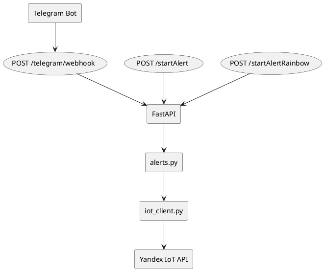
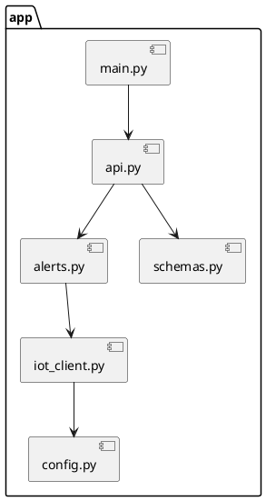
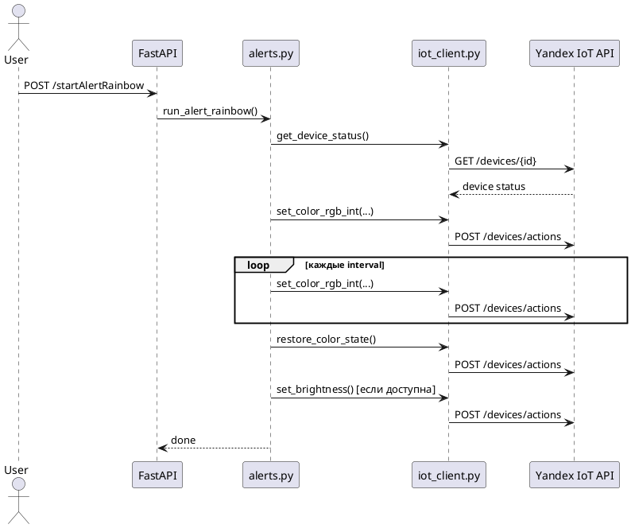
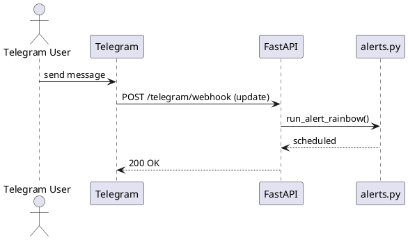
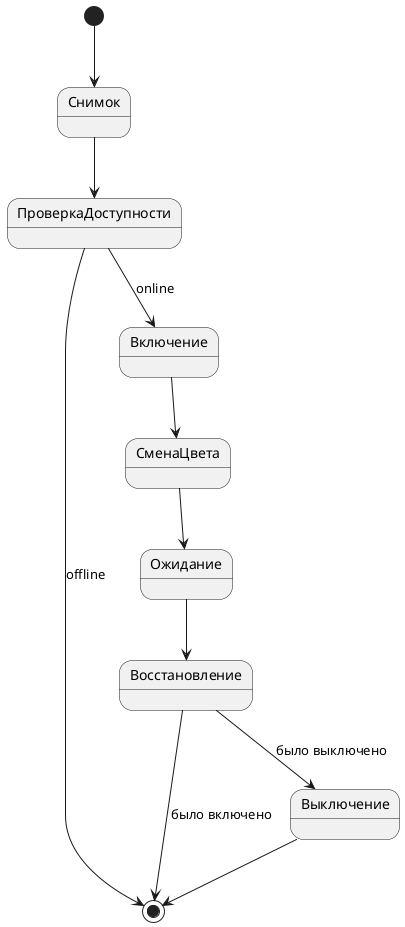

# iotalarm

Простой FastAPI‑сервис для запуска световых алертов на лампе Яндекс IoT (один цвет или мигание между двумя цветами) и Telegram‑вебхука, который запускает алерт на любое входящее сообщение. Проект рассчитан на один `device_id` и читает настройки из переменных окружения.

## Возможности
- Одноцветный алерт на заданную длительность.
- Радужный алерт: мигание между двумя цветами.
- Восстановление исходного цвета и яркости после завершения алерта.
- Telegram‑вебхук, который срабатывает на сообщения в `private`, `group`, `supergroup`.

## Структура проекта
- `app/main.py` — входная точка Uvicorn.
- `app/api.py` — FastAPI‑роуты и Telegram‑вебхук.
- `app/alerts.py` — сценарии алертов, снимок состояния и восстановление.
- `app/iot_client.py` — клиент Яндекс IoT и вспомогательные функции.
- `app/config.py` — чтение переменных окружения.
- `hello-ngrok/` — пример запуска ngrok.

## Требования
- Python 3.9+
- `pip install -r requrments.txt`

## Конфигурация (переменные окружения)
Обязательные:
- `IOT_TOKEN` — OAuth‑токен Яндекс IoT.
- `IOT_DEVICE_ID` — ID лампы.

Необязательные:
- `IOT_HOST` (по умолчанию: `https://api.iot.yandex.net`)
- `ALERT_COLOR_HEX` (по умолчанию: `#FF0000`)
- `ALERT_COLOR_HEX_2` (по умолчанию: `#E30306`)
- `ALERT_DURATION_SEC` (по умолчанию: `10`)
- `ALERT_BLINK_INTERVAL` (по умолчанию: `0.5`)
- `TELEGRAM_BOT_TOKEN` — токен Telegram бота (для вебхука).
- `NGROK_AUTHTOKEN` — токен ngrok (если используется).

Также поддерживается `config.yaml` (ключи совпадают с именами переменных окружения).
Если переменная окружения задана, она имеет приоритет над значением в `config.yaml`.

## Запуск
- API сервер: `python3 app/main.py`
- Или: `make start` (сначала `app/main.py`, затем `hello-ngrok/example.py`)

## API эндпоинты

### `POST /startAlert`
Тело:
```json
{
  "color_hex": "#00FF00",
  "duration_sec": 5
}
```

### `POST /startAlertRainbow`
Тело:
```json
{
  "color_hex": "#00FF00",
  "color_hex_2": "#E3C803",
  "duration_sec": 5
}
```

### `POST /telegram/webhook`
Принимает сырые Telegram‑апдейты. Любое сообщение в `private`, `group` или `supergroup` запускает радужный алерт.

Чтобы получать апдейты, настрой webhook вашего бота на публичный URL этого эндпоинта.

## Настройка через мастер (backend)

Эти эндпоинты предназначены для простого фронта‑мастера.

### `POST /setup/credentials`
Сохраняет токены в `config.yaml`:
```json
{
  "yandex_token": "token",
  "telegram_bot_token": "token",
  "ngrok_authtoken": "token"
}
```

### `GET /setup/devices`
Возвращает список доступных устройств освещения со статусом `ok`:
```json
{
  "devices": [
    {"id": "device_id", "name": "Лампочка", "state": "online"}
  ]
}
```

### `POST /setup/device`
Выбор устройства:
```json
{
  "device_id": "device_id"
}
```

### `POST /setup/alert-settings`
Сохраняет настройки алерта:
```json
{
  "color_hex": "#00FF00",
  "color_hex_2": "#E3C803",
  "duration_sec": 5,
  "blink_interval_sec": 0.5
}
```

## Модули и логика

### `app/config.py`
Читает переменные окружения и выставляет значения по умолчанию:
- `IOT_TOKEN`, `IOT_DEVICE_ID` — обязательные.
- `IOT_HOST`, `ALERT_COLOR_HEX`, `ALERT_COLOR_HEX_2`, `ALERT_DURATION_SEC`, `ALERT_BLINK_INTERVAL` — опциональные.
Опционально загружает `.env` через `python-dotenv`, если пакет установлен.

### `app/schemas.py`
Pydantic‑модели запросов:
- `AlertRequest`: `color_hex`, `duration_sec`.
- `AlertRainbowRequest`: `color_hex`, `color_hex_2`, `duration_sec`.

### `app/iot_client.py`
Клиент Яндекс IoT и вспомогательные функции:
- `hex_to_yandex_rgb()` — принимает `#RRGGBB`/`RRGGBB` и возвращает 24‑битное число (0..16777215).
- `rgb_int_to_yandex_hsv()` — конвертирует RGB‑число в словарь `{h, s, v}` (0..360/100/100).
- `get_device_status()` — `GET /devices/{id}`, логирует и возвращает сырой ответ.
- `find_capability()` — находит capability по `type` в списке.
- `is_device_available()` — проверяет `state == "online"`.
- `is_device_on()` — читает `devices.capabilities.on_off`.
- `get_color_state()` — достает текущий цвет (`instance`, `value`) из `color_setting`.
- `get_color_model()` — читает `parameters.color_model` (например, `rgb`, `hsv`).
- `get_brightness_value()` — находит яркость из `devices.capabilities.range` с `instance=brightness`.
- `send_actions()` — `POST /devices/actions` и лог ответа.
- `turn_on()` / `turn_off()` — включение/выключение через `on_off`.
- `set_color_rgb_int()` — устанавливает цвет; если `color_model=rgb`, шлет `instance=rgb`, иначе `instance=hsv`.
- `set_brightness()` — выставляет яркость через `range/brightness`.
- `restore_color_state()` — восстанавливает сохраненное состояние цвета как есть.

### `app/alerts.py`
Основные сценарии алертов и восстановление состояния.

Класс:
- `DeviceSnapshot` — снимок состояния устройства:
  - `available` — доступность (online/offline).
  - `was_on` — было ли устройство включено.
  - `color_state` — сохраненный цвет.
  - `color_model` — модель цвета (`rgb`/`hsv`).
  - `brightness` — сохраненная яркость.

Функции:
- `remember_device_state()` — получает состояние устройства и формирует `DeviceSnapshot`.
- `run_alert()` — одноцветный алерт:
  1. Снимает состояние.
  2. Включает лампу, если она была выключена.
  3. Устанавливает цвет.
  4. Ждет `duration_sec`.
  5. Восстанавливает цвет и яркость.
  6. Возвращает лампу в исходное состояние (выключает, если была выключена).
- `run_alert_rainbow()` — мигание между двумя цветами:
  1. Снимает состояние.
  2. Включает лампу при необходимости.
  3. Циклически переключает цвета с интервалом `ALERT_BLINK_INTERVAL`.
  4. Восстанавливает цвет и яркость.
  5. Возвращает лампу в исходное состояние.

### `app/api.py`
FastAPI‑роуты:
- `POST /startAlert` — запускает одноцветный алерт в фоновом таске.
- `POST /startAlertRainbow` — запускает радужный алерт в фоновом таске.
- `POST /telegram/webhook` — принимает Telegram update и запускает радужный алерт для любых сообщений в `private`, `group`, `supergroup`.

### `app/main.py`
Точка входа для запуска Uvicorn:
- Хост: `0.0.0.0`
- Порт: `8000`
- `reload=True` для разработки

## Диаграммы (PlantUML)

### Компоненты


### Диаграмма пакетов (модули)


### Последовательность: радужный алерт


### Последовательность: Telegram webhook


### Состояния: алерт


## Troubleshooting
- `400 Client Error` от Яндекс IoT обычно означает несовпадение `color_model` и отправляемого payload.
- Если лампа визуально не возвращается к исходному состоянию, проверьте поддержку `brightness` и `retrievable` у capabilities устройства.

## Примеры запросов (curl)

Одноцветный алерт:
```bash
curl -sS -X POST http://localhost:8000/startAlert \
  -H "Content-Type: application/json" \
  -d '{"color_hex":"#00FF00","duration_sec":5}'
```

Радужный алерт:
```bash
curl -sS -X POST http://localhost:8000/startAlertRainbow \
  -H "Content-Type: application/json" \
  -d '{"color_hex":"#00FF00","color_hex_2":"#E3C803","duration_sec":5}'
```

## Настройка Telegram webhook (шаги)
1) Создай бота через `@BotFather` и получи токен.
2) Подними сервис локально: `python3 app/main.py`.
3) Пробрось порт наружу (например, через ngrok), чтобы получить публичный HTTPS URL.
4) Установи webhook:
```bash
curl -sS -X POST "https://api.telegram.org/bot<TELEGRAM_BOT_TOKEN>/setWebhook" \
  -d "url=https://<PUBLIC_HOST>/telegram/webhook"
```
5) Проверь, что webhook установлен:
```bash
curl -sS "https://api.telegram.org/bot<TELEGRAM_BOT_TOKEN>/getWebhookInfo"
```
6) Напиши боту в личку или в группу — должен запуститься радужный алерт.
